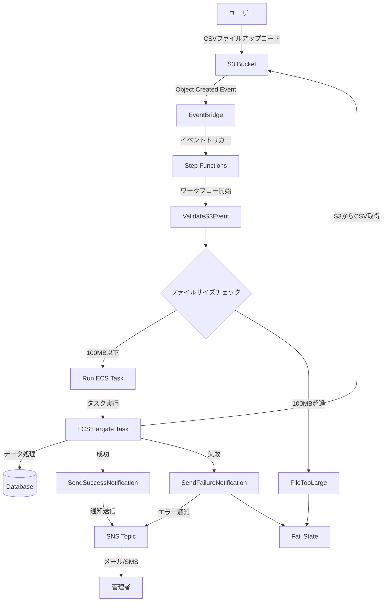
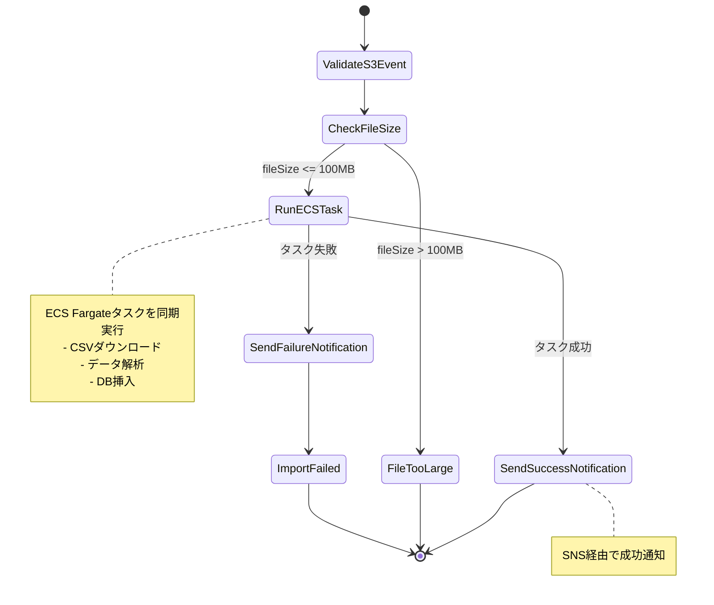
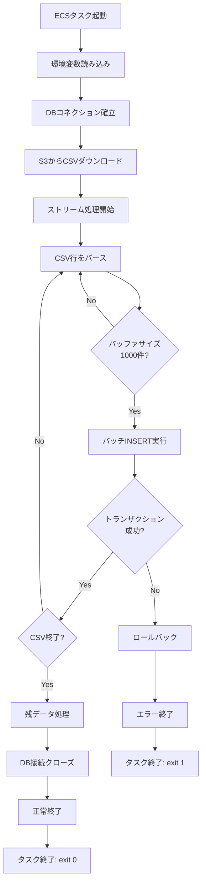
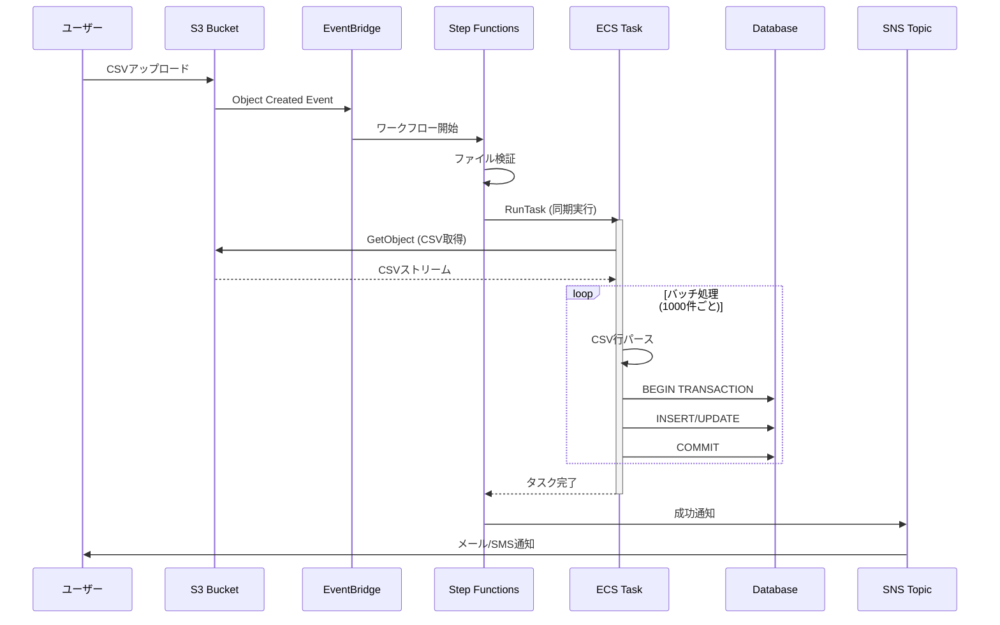
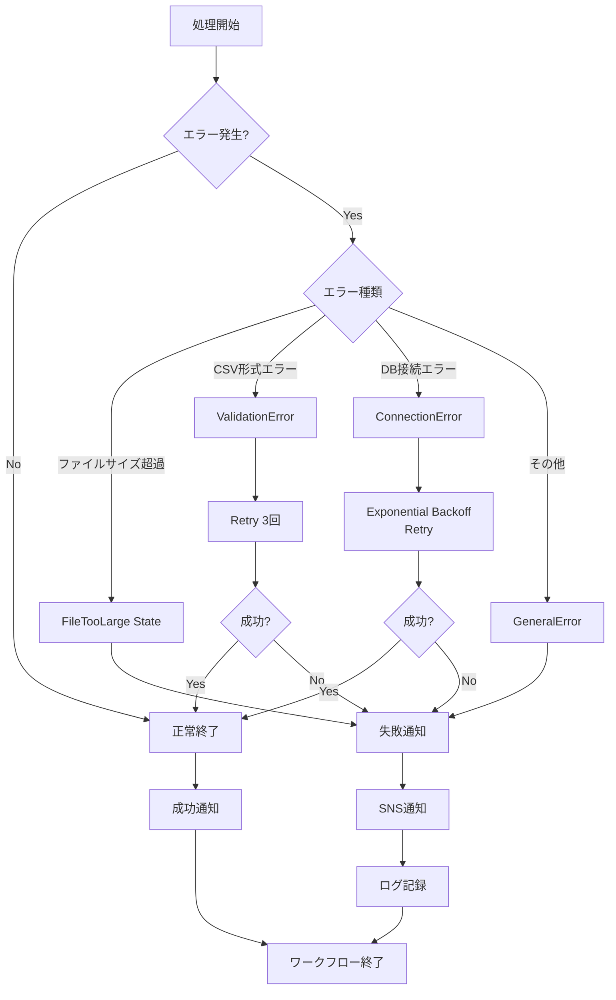
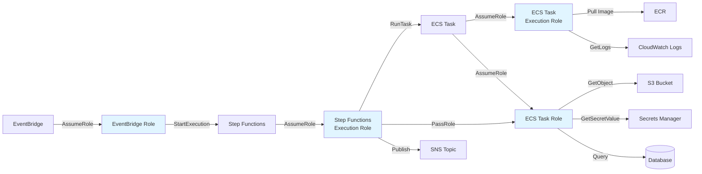
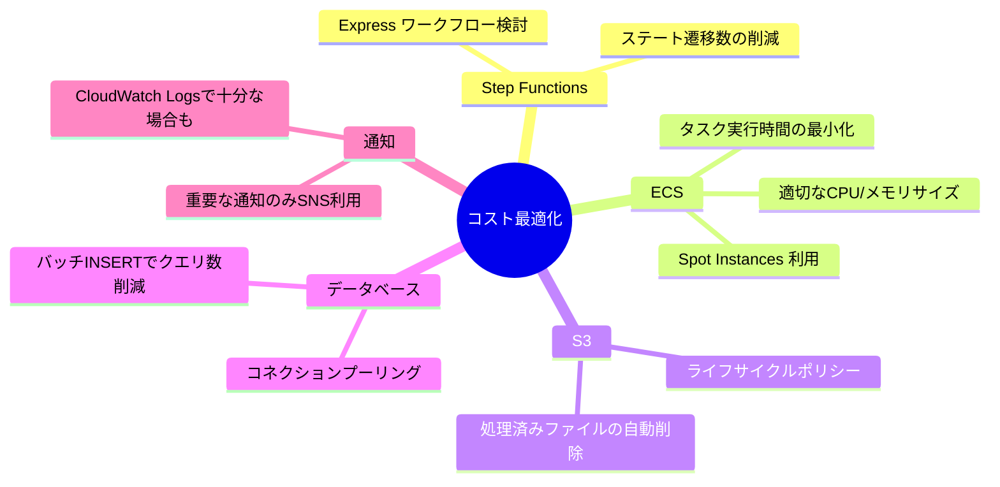
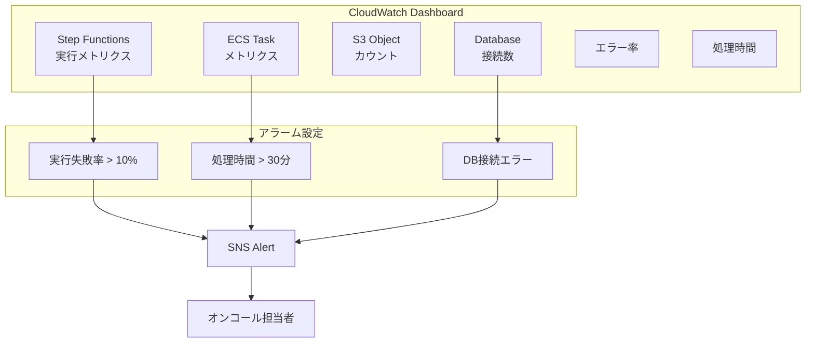

# CSVインポートシステム フロー図

## システム全体のフロー

## Step Functions ワークフロー詳細

## ECS タスク内部処理フロー

## データフロー

## エラーハンドリングフロー

## IAMロールと権限フロー

## コスト最適化の考慮点

## システム監視ダッシュボード構成

---

## 使用方法

このMarkdownファイルは、Mermaid記法を使用しています。以下の環境で図を表示できます：

- **GitHub**: 自動的にレンダリング
- **VS Code**: Mermaid拡張機能をインストール
- **Notion**: Mermaidブロックにコピー
- **Confluence**: Mermaid Diagramマクロを使用
- **オンライン**: https://mermaid.live/ でプレビュー

## 各図の説明

1. **システム全体のフロー**: エンドツーエンドの処理の流れ
2. **Step Functions ワークフロー詳細**: ステートマシンの状態遷移
3. **ECS タスク内部処理フロー**: CSVインポート処理の詳細
4. **データフロー**: コンポーネント間の通信シーケンス
5. **エラーハンドリングフロー**: エラー発生時の処理分岐
6. **IAMロールと権限フロー**: 各サービスの権限関係
7. **コスト最適化の考慮点**: コスト削減のポイント
8. **システム監視ダッシュボード構成**: 監視項目とアラート設定
